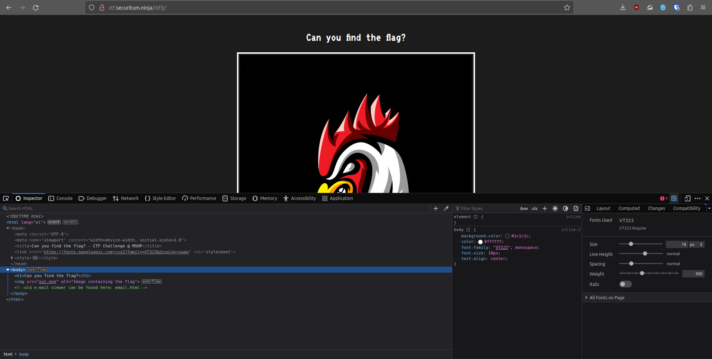
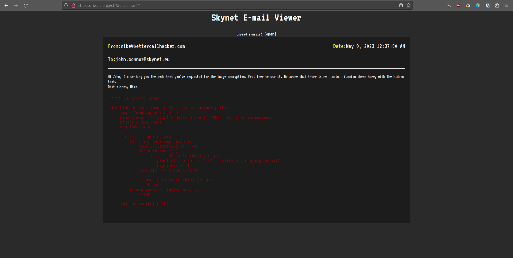

# MSHP 2023 - [3] steganoBuster.py

**CTF Name:** MEGA SEKURAK HACKING PARTY 2023
**Challenge name:** [3] steganoBuster.py
**Challenge description:**
> Find the hidden message in pic. But how? I don't know, maybe this server is not about steganography? 

**Challenge URL:** http://ctf.securitum.ninja/ctf3/
**Challenge category:** forensics/stegano
**Challenge points:** 100

* * *

## Steps to solve
Website that we were presented with was made out of instruction "Can you find the flag?" and image of an angered rooster. Also source code revealed hint towards existence of subpage *email.html*:


*email.html* Skynet E-mail Viewer had one unread email with python code inside - specifically crafted for encrypting text inside of image files:


What does this code do?
1. Open image
2. Format every char in the message into 8-bits long binary form (char -> int -> binary)
3. Load matrice of image pixels
4. For each R/G/B pixel replace LSb (least-significant-bit) with corresponding value at index msg_index from binary_msg
5. Increment msg_index and break when whole message is encoded
6. Save image to the file

What I had to do last, to retrieve the flag, was to reverse this **hide_message** functionality.

After short analysis, I realised that it suffices to scan starting **LSb’s** of given image to retrieve the flag. Of course I had to make sure my python function would work on 8-bits chars and would cast those correctly to string format.

```python
from PIL import Image

def show_message(image_path, expected_length):
    img = Image.open(image_path)
    pixels = img.load()
    msg_index = 0
    message = ''
    # Remember that every char is in 8-bits long binary form
    length = expected_length * 8

    for x in range(img.width):
        for y in range(img.height):
            pixel = list(pixels[x, y])
            for n in range(3):
                if msg_index < length:
                    # Append LSb to the message string (cast LSb -> int -> str)
                    message += str(int(pixel[n] & 1))
                    msg_index += 1
            pixels[x, y] = tuple(pixel)

            if msg_index >= length:
                break
        if msg_index >= length:
            break

    # Create flag string out of 8-bits long binary (iterate every 8 - till message length, and cast 8-bits long bin -> int -> chr)
    flag = ''.join(chr(int(message[i:i+8], 2)) for i in range(0, len(message), 8))
    print(flag)

# Based on previous flags, expect 22 characters long flag
show_message('./out.png', 22)
```

Executing code above resulted in:
```
$ python3 flag.py
MSHP_{vr$LJzTg2#7iWdH}
```

**FLAG:** MSHP_{vr$LJzTg2#7iWdH}

## Additional comments
I found this challenge the most interesting from all. Steganography is very cool mechanism, it's implemenatation and reverse engineering in python was phenomenal experience for me.