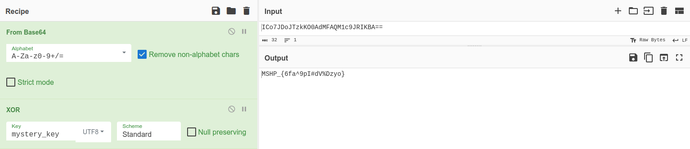

# MSHP 2023 - [4] $reverseme, harry  

**CTF Name:** MEGA SEKURAK HACKING PARTY 2023  
**Challenge name:** [4] $reverseme, harry  
**Challenge description:**  
> "He Who Must Not Be Xored" is ummaterialized! If you want him to regain his strength, you must obtain his soul parts and try to figure out the mystery_key.   

**Challenge URL:** http://ctf.securitum.ninja/ctf4/new  
**Challenge category:** reverse  
**Challenge points:** 100  

* * *  

## Steps to solve  
This challenge involved downloading binary file from CTF webpage. The binary name was *new* and no further information about it's functionality was given. However the hint guided us towards thinkng about **XOR-ing** something and **finding mystery_key**.  

I began with my standard binary static analysis procedure: *file, strings, readelf, objdump*; to gain insights on the given file.  

```shell  
$ file new  
new: ELF 64-bit LSB pie executable, x86-64, version 1 (SYSV), dynamically linked, interpreter /lib64/ld-linux-x86-64.so.2, BuildID[sha1]=67d9768e1bad0cf8c9d6052ebd4a3e3a563a60f3, for GNU/Linux 3.2.0, not stripped  
```  

```shell  
$ strings new  
/lib64/ld-linux-x86-64.so.2  
.  
.  
.  
__cxa_finalize  
malloc  
__libc_start_main  
strcmp  
puts  
free  
strlen  
__isoc99_scanf  
__stack_chk_fail  
printf  
libcrypto.so.3  
libc.so.6  
OPENSSL_3.0.0  
GLIBC_2.34  
GLIBC_2.7  
GLIBC_2.4  
GLIBC_2.2.5  
PTE1  
u+UH  
ICo7JDoJTzkKO0AdMFAQM1c9JRIKBA==  
GQpXJFNRFBRSJQMuQQ==  
Wprowadz klucz:   
mystery_key  
Uzyskales dostep do ukrytej funkcjonalnosci!  
Flaga: %s  
Klucz jest niepoprawny!  
:*3$"  
GCC: (Ubuntu 11.3.0-1ubuntu1~22.04) 11.3.0  
.  
.  
.  
xor_encrypt  
free@GLIBC_2.2.5  
strlen@GLIBC_2.2.5  
_ITM_registerTMCloneTable  
__data_start  
BIO_f_base64@OPENSSL_3.0.0  
__cxa_finalize@GLIBC_2.2.5  
base64_decode  
.  
.  
.  
.data  
.bss  
.comment  
```  

*Strings* was already interesting, as somewhere in the middle of it's output I could see **two base64 encoded strings** and couple of program messages. Also, I found out more or less about functions used in the program, to make first assumptions.  

> What are those base64 encoded strings?  
> I see C functions: malloc, strcmp, puts, free, strlen, printf  
> This program must involve XOR operations and base64 operations (xor_encrypt, base64_decode functions)  
> Program messages make me think that one must enter proper key to receive flag  
> Is mystery_key variable or text? Should variable names be visible in strings? I don't think so  

For the sake of this writeup, I won't bother you with outputs of:  
```shell  
$ readelf -r new  
```  
and  
```shell  
$ objdump -D new  
```  

Next I proceeded with debugging this binary with *gdb*.  
First I changed assembly syntax to intel, then I created breakpoint at main function to disassemble it:  
```shell  
(gdb) set disassembly-flavor intel  
(gdb) break main  
(gdb) run  
(gdb) disass  
```  

```  
Dump of assembler code for function main:  
   0x0000555555555472 <+0>:	endbr64   
   0x0000555555555476 <+4>:	push   rbp  
   0x0000555555555477 <+5>:	mov    rbp,rsp  
=> 0x000055555555547a <+8>:	sub    rsp,0x90  
   0x0000555555555481 <+15>:	mov    rax,QWORD PTR fs:0x28  
   0x000055555555548a <+24>:	mov    QWORD PTR [rbp-0x8],rax  
   0x000055555555548e <+28>:	xor    eax,eax  
   0x0000555555555490 <+30>:	lea    rax,[rip+0xb71]        # 0x555555556008  
   0x0000555555555497 <+37>:	mov    rdi,rax  
   0x000055555555549a <+40>:	call   0x5555555553b2 <base64_decode>  
   0x000055555555549f <+45>:	mov    QWORD PTR [rbp-0x90],rax  
   0x00005555555554a6 <+52>:	lea    rax,[rip+0xb7c]        # 0x555555556029  
   0x00005555555554ad <+59>:	mov    rdi,rax  
   0x00005555555554b0 <+62>:	call   0x5555555553b2 <base64_decode>  
   0x00005555555554b5 <+67>:	mov    QWORD PTR [rbp-0x88],rax  
   0x00005555555554bc <+74>:	lea    rax,[rip+0xb7b]        # 0x55555555603e  
   0x00005555555554c3 <+81>:	mov    rdi,rax  
   0x00005555555554c6 <+84>:	mov    eax,0x0  
   0x00005555555554cb <+89>:	call   0x555555555130 <printf@plt>  
   0x00005555555554d0 <+94>:	lea    rax,[rbp-0x70]  
   0x00005555555554d4 <+98>:	mov    rsi,rax  
   0x00005555555554d7 <+101>:	lea    rax,[rip+0xb71]        # 0x55555555604f  
   0x00005555555554de <+108>:	mov    rdi,rax  
   0x00005555555554e1 <+111>:	mov    eax,0x0  
   0x00005555555554e6 <+116>:	call   0x555555555210 <__isoc99_scanf@plt>  
   0x00005555555554eb <+121>:	lea    rax,[rbp-0x70]  
   0x00005555555554ef <+125>:	lea    rdx,[rip+0xb5c]        # 0x555555556052  
   0x00005555555554f6 <+132>:	mov    rsi,rdx  
   0x00005555555554f9 <+135>:	mov    rdi,rax  
   0x00005555555554fc <+138>:	call   0x555555555309 <xor_encrypt>  
   0x0000555555555501 <+143>:	mov    QWORD PTR [rbp-0x80],rax  
   0x0000555555555505 <+147>:	mov    rdx,QWORD PTR [rbp-0x88]  
   0x000055555555550c <+154>:	mov    rax,QWORD PTR [rbp-0x80]  
   0x0000555555555510 <+158>:	mov    rsi,rdx  
   0x0000555555555513 <+161>:	mov    rdi,rax  
   0x0000555555555516 <+164>:	call   0x555555555200 <strcmp@plt>  
   0x000055555555551b <+169>:	test   eax,eax  
   0x000055555555551d <+171>:	jne    0x555555555574 <main+258>  
   0x000055555555551f <+173>:	lea    rax,[rip+0xb3a]        # 0x555555556060  
   0x0000555555555526 <+180>:	mov    rdi,rax  
   0x0000555555555529 <+183>:	call   0x555555555160 <puts@plt>  
   0x000055555555552e <+188>:	mov    rax,QWORD PTR [rbp-0x90]  
   0x0000555555555535 <+195>:	lea    rdx,[rip+0xb16]        # 0x555555556052  
   0x000055555555553c <+202>:	mov    rsi,rdx  
   0x000055555555553f <+205>:	mov    rdi,rax  
   0x0000555555555542 <+208>:	call   0x555555555309 <xor_encrypt>  
   0x0000555555555547 <+213>:	mov    QWORD PTR [rbp-0x78],rax  
   0x000055555555554b <+217>:	mov    rax,QWORD PTR [rbp-0x78]  
   0x000055555555554f <+221>:	mov    rsi,rax  
   0x0000555555555552 <+224>:	lea    rax,[rip+0xb34]        # 0x55555555608d  
   0x0000555555555559 <+231>:	mov    rdi,rax  
   0x000055555555555c <+234>:	mov    eax,0x0  
   0x0000555555555561 <+239>:	call   0x555555555130 <printf@plt>  
   0x0000555555555566 <+244>:	mov    rax,QWORD PTR [rbp-0x78]  
   0x000055555555556a <+248>:	mov    rdi,rax  
   0x000055555555556d <+251>:	call   0x5555555551b0 <free@plt>  
   0x0000555555555572 <+256>:	jmp    0x555555555583 <main+273>  
   0x0000555555555574 <+258>:	lea    rax,[rip+0xb1d]        # 0x555555556098  
   0x000055555555557b <+265>:	mov    rdi,rax  
   0x000055555555557e <+268>:	call   0x555555555160 <puts@plt>  
   0x0000555555555583 <+273>:	mov    rax,QWORD PTR [rbp-0x90]  
   0x000055555555558a <+280>:	mov    rdi,rax  
   0x000055555555558d <+283>:	call   0x5555555551b0 <free@plt>  
   0x0000555555555592 <+288>:	mov    rax,QWORD PTR [rbp-0x88]  
   0x0000555555555599 <+295>:	mov    rdi,rax  
   0x000055555555559c <+298>:	call   0x5555555551b0 <free@plt>  
   0x00005555555555a1 <+303>:	mov    rax,QWORD PTR [rbp-0x80]  
   0x00005555555555a5 <+307>:	mov    rdi,rax  
   0x00005555555555a8 <+310>:	call   0x5555555551b0 <free@plt>  
   0x00005555555555ad <+315>:	mov    eax,0x0  
   0x00005555555555b2 <+320>:	mov    rdx,QWORD PTR [rbp-0x8]  
   0x00005555555555b6 <+324>:	sub    rdx,QWORD PTR fs:0x28  
   0x00005555555555bf <+333>:	je     0x5555555555c6 <main+340>  
   0x00005555555555c1 <+335>:	call   0x5555555551f0 <__stack_chk_fail@plt>  
   0x00005555555555c6 <+340>:	leave    
   0x00005555555555c7 <+341>:	ret      
End of assembler dump.  
```  

Sole main function assembler dump allowed me to write down **key execution points**:  
1. base64_decode value at 0x555555556008 ("ICo7JDoJTzkKO0AdMFAQM1c9JRIKBA"==) and store result in [rbp-0x90]  
2. base64_decode value at 0x555555556029 ("GQpXJFNRFBRSJQMuQQ"==) and store result in [rbp-0x88]  
3. printf value at 0x55555555603e ("Wprowadz klucz: ")  
4. Wait for input string and store it in [rbp-0x70]  
5. xor_encrypt [rbp-0x70] with value at 0x555555556052 and store result in [rbp-0x80]  
6. strcmp (string compare) values at [rbp-0x88] and [rbp-0x80]  
7. If not equal, then execute exit procedure  
8. If equal, then xor_encrypt [rbp-0x90] with value at 0x555555556052 and store result in [rbp-0x78]  
9. printf value at [rbp-0x78]  

From the points above, I could observe that both base64 encoded strings are first decoded and saved to [rbp-0x90] and [rbp-0x88] accordingly, then user provided input is XORed with value at address 0x555555556052, then the result is compared with value in [rbp-0x88]. If they are equal, [rbp-0x90] is XORed with value of same address as user input was 0x555555556052. The result of last operation is the flag.  

Thus, to receive the flag, I had to find what the contents of 0x555555556052 address were.  
It wasn't very hard, I knew that 0x55555555603e addr. corresponded to "Wprowadz klucz: " string, as I used this knowledge previously to find in what order base64 encoded strings were decoded.  
```  
0x555555556052 - 0x55555555603e = 0x14  
where 0x11 is the length of "Wprowadz klucz: " string  
and sscanf reserved "%s" which is 0x3 long  
```  

**Meaning that 0x555555556052 address can be resolved to "mystery_key" string.**  

If that statement is correct, then it means that XORing base64 decoded "ICo7JDoJTzkKO0AdMFAQM1c9JRIKBA==" string with "mystery_key" string should result in flag.  

*CyberChef* into action!:  
  
Quod erat demonstrandum  

**FLAG:** MSHP_{6fa^9pI#dV%Dzyo}