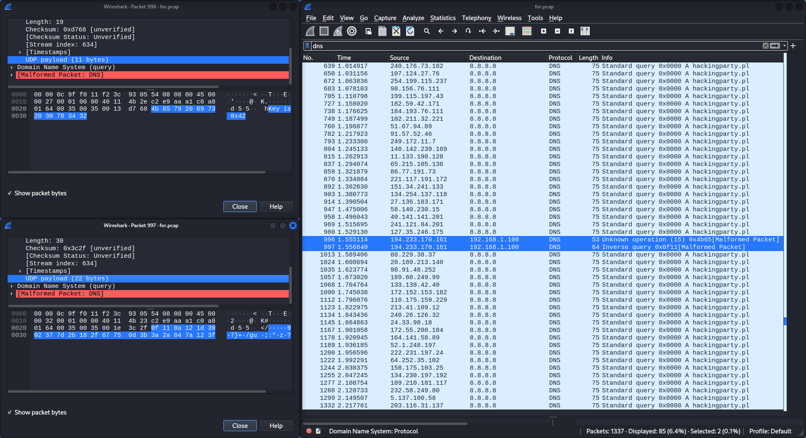
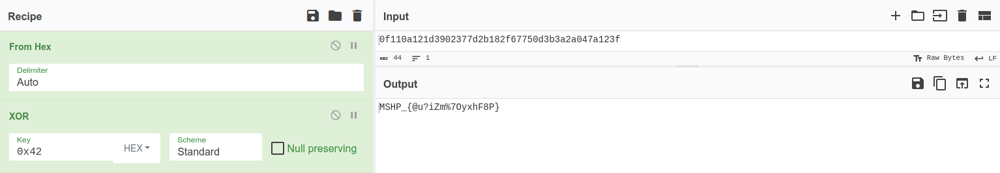

# MSHP 2023 - [5] captain forensics

**CTF Name:** MEGA SEKURAK HACKING PARTY 2023
**Challenge name:** [5] captain forensics
**Challenge description:**
> A twin suspicious network packets were captured during a recent incident. Your task is to analyze the packet capture file and retrieve the secret xormunnication!

**Challenge URL:** http://ctf.securitum.ninja/ctf5/for.pcap
**Challenge category:** forensics/pcap
**Challenge points:** 100

* * *

## Steps to solve
This challenge involved downloading attached *for.pcap* file to analyze it in *Wireshark*.

At first glance I noticed many ARP packets...

> So at the time I thought:
> Maybe this challenge is about ARP spoofing?
> It wasn't

To **verify whether *ARP spoofing*** was taking place, I firstly browsed through ARP packets manually with **arp** filter specified. However I couldn't find anything suspicious there, so I decided to apply concatenation of couple filters:
```
arp.duplicate-address-detected || arp.duplicate-address-frame || arp.packet-storm-detected
```
Nothing was listed, thus *ARP spoofing* was not present.

Second thought that came to my mind was DNS, maybe *DNS spoofing*? Or how about *DNS exfiltration attack*?
I filtered all the packets in *Wireshark* by DNS protocol and had a quick look, **two packets stood out** from the rest:


*Wireshark* already marked both of those as **Malformed Packets** which is obvious why, when we look at those packets structure.
But the most important part of those two is their **UDP Payload**. I highlighted it in both cases, which comes handy in the next step.
Remember the description? And more specifically word **xormunnication** - I am sure you know what it means.

Once again, welcome *CyberChef* and XOR operation (I XORed both payloads with each other):


**FLAG:** MSHP_{@u?iZm%7OyxhF8P}