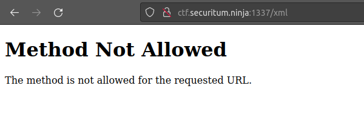
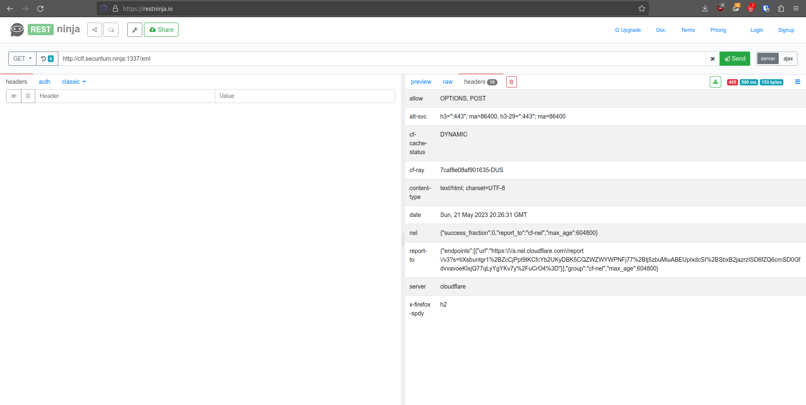
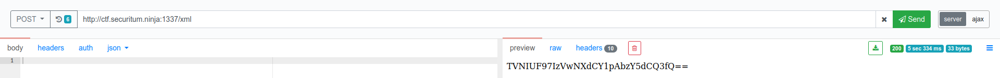
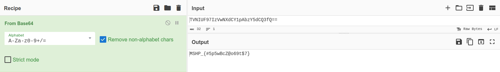

# MSHP 2023 - [6] crypto.xxe

**CTF Name:** MEGA SEKURAK HACKING PARTY 2023
**Challenge name:** [6] crypto.xxe
**Challenge description:**
> A cryptographic challenge? Meh, just take the /tmp/flag and then what?
> UPDATE
> New encoding in response (easier)! 

**Challenge URL:** http://ctf.securitum.ninja:1337/xml
**Challenge category:** websec
**Challenge points:** 100

* * *

## Steps to solve
This challenge was different from the others. When I visited provided URL link, the only thing that could be seen was "Method Not Allowed" **HTTP 405** error message. Strange right?


I decided to look at full picture. I used *restninja.io* to send same GET request as my browser - it allowed me to see **RAW response and all headers** connected to this request:


And funnily enough that was almost all I needed to solve this challenge: **allow response header mentioned OPTIONS and POST**. That's why I sent POST request to the same URL address as before, and received this response:


```
TVNIUF97IzVwNXdCY1pAbzY5dCQ3fQ== 
```

One last thing to do was to decode this base64 string (as usual I used *CyberChef*):


**FLAG:** MSHP_{#5p5wBcZ@o69t$7}

## Additional comments
I have no idea what was the idea behind challenge description/hint. As I did nothing with /tmp/flag and still was able to retrieve the flag.