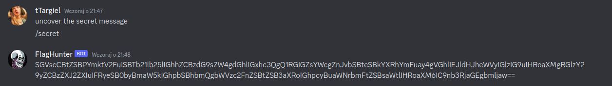
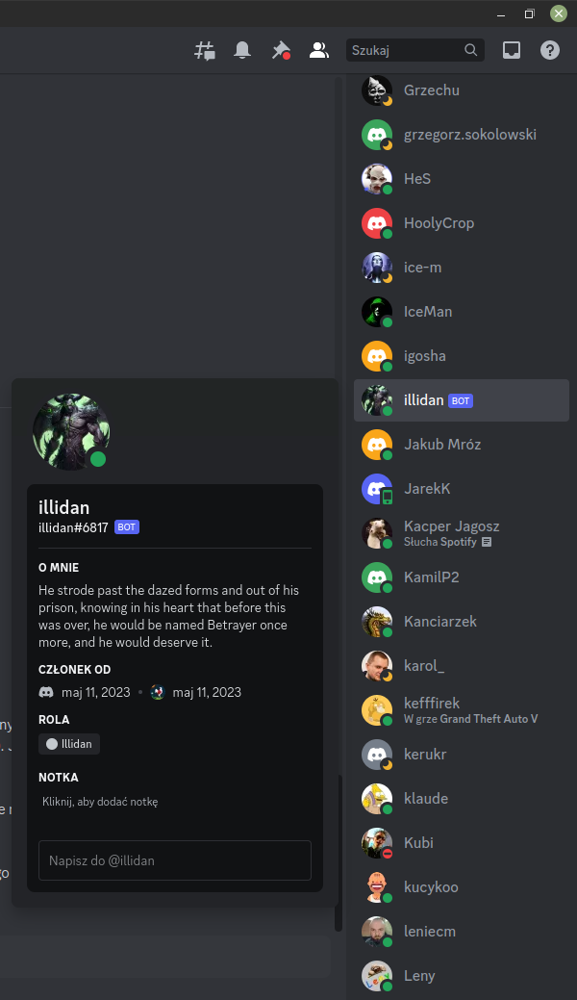
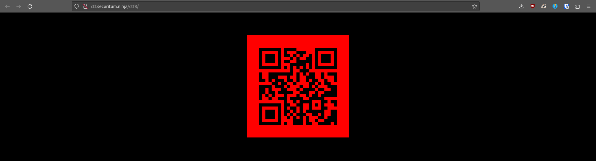

# MSHP 2023 - [8] betrayal

**CTF Name:** MEGA SEKURAK HACKING PARTY 2023
**Challenge name:** [8] betrayal
**Challenge description:**
> Someone has bypassed our security systems and hacked the FlagHunter bot. Try to ask him to uncover the secret message. Help him retrieve the stolen flag! 

**Challenge category:** misc/extra
**Challenge points:** 100

* * *

## Steps to solve
Challenge description mentioned that *FlagHunter Discord Bot* has been hacked and is prone to giving away secret message. I tried messaging him as follows:


Which resulted in receiving this secret message from him:
```
SGVscCBtZSBPYmktV2FuISBTb21lb25lIGhhZCBzdG9sZW4gdGhlIGxhc3QgQ1RGIGZsYWcgZnJvbSBteSBkYXRhYmFuay4gVGhlIEJldHJheWVyIGlzIG9uIHRoaXMgRGlzY29yZCBzZXJ2ZXIuIFRyeSB0byBmaW5kIGhpbSBhbmQgbWVzc2FnZSBtZSB3aXRoIGhpcyBuaWNrbmFtZSBsaWtlIHRoaXM6IC9nb3RjaGEgbmljaw==
```

We can clearly see that it is base64, so *CyberChef* came in handy to decode the message, leaving me with:
```
Help me Obi-Wan! Someone had stolen the last CTF flag from my databank. The Betrayer is on this Discord server. Try to find him and message me with his nickname like this: /gotcha nick
```

And here is the **pseudo-hint** that almost gave me nightmares. I am not a huge fan of Star-Wars, but this text is obviously about Star-Wars...

In the Star Wars universe, the character who could be referred to as "The Betrayer" in relation to Obi-Wan Kenobi is Anakin Skywalker, who later becomes Darth Vader.

But you know what? There was nobody there in Discord with nickname similiar to either Anakin Skywalker or Darth Vader!

So, who else could receive "The Betrayer" nickname in Star-Wars?
I made some research, and those are the results:
- Count Dooku
- General Grievous
- Darth Maul/Savage Opress

You guessed that right, it lead me nowhere! None of those was present in Discord channel...

That's why I had to think about this challenge for a bit.
In the meantime another hint was published: "The Betrayer" supposedly announced something on Discord during CTF and later on storm-raged.

> It didn't really help, but one thought came to my head:
> If "The Betrayer" announced something on Discord during CTF
> And he was spawned by organisers
> He most probably has to be a BOT!
> I was right

Except for FlagHunter Discord Bot, there was only one other: **illidan**


Messaging FlagHunter with:
```
/gotcha illidan
```
made him redirect me to http://ctf.securitum.ninja/ctf8/

Then all left to do was to scan QR code, to receive the flag:


**FLAG:** MSHP_{@A62qw2?h*JxNtM}

## Additional comments
I didn’t really like this challenge, because it falsely guided me towards **Star-Wars** universe, even though **Illidan Stormrage** appears in **World of Warcraft** universe…

I am happy that after all I solved the challenges, but I don’t like being mislead.