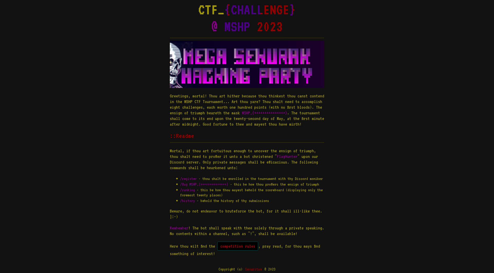
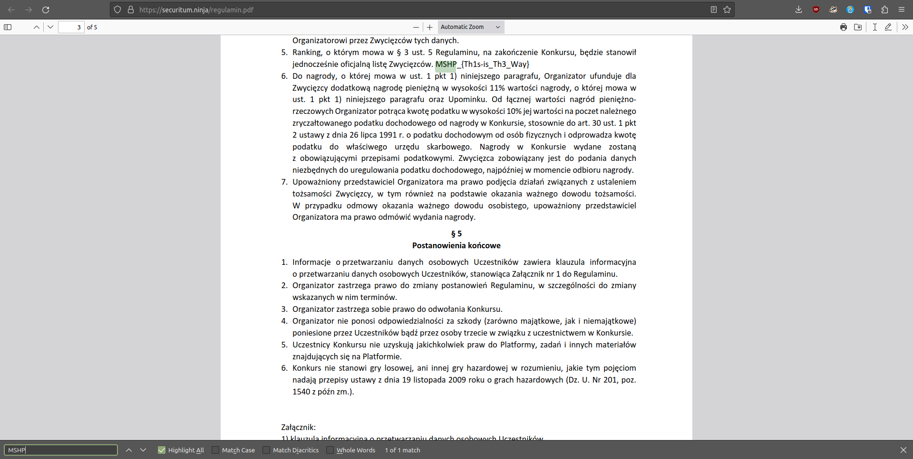

# MSHP 2023 - [9] leak  

**CTF Name:** MEGA SEKURAK HACKING PARTY 2023  
**Challenge name:** [9] leak  
**Challenge description:**  
> WYCIEK!  
> Uwaga! Dostałem informację od @FlagHunter, że jedna flaga... wyciekła :memesgifbomb: i można ją opublikować już dzisiaj! WTF! :dog:   
> Zatem musimy ranking zmienić na 900 pkt maksymalnie!   
> #jak_do_tego_doszło_nie_wiem #wtf #leak #hardcore #mshp #wow #amazing  

Translated into English:  
> LEAK!  
> Attention! I received information from @FlagHunter that one flag... has leaked :memesgifbomb: and it can be published today! WTF! :dog:  
> Therefore, we need to change the ranking to a maximum of 900 points!  
> #how_did_this_happen_i_dont_know #wtf #leak #hardcore #mshp #wow #amazing  

**Challenge category:** misc/extra  
**Challenge points:** 100  

* * *  

## Steps to solve  
Based on challenge description (which was published on *MSHP Discord server* one day before CTF started) I was able to guess that flag is to be seen somewhere in publicly available resources on **either Discord or CTF webpage**.  

Thorough investigation of *MSHP Discord server* subchannels brought no luck to me.  
However CTF webpage was more promising, can you see something interesting on the screenshot below?  
  

I personally was very much interested in this "competition rules" button.  

And bingo! it was a hit - **CTRL+F** to search for **MSHP** revealed secret additional flag:  
  

It seems that reading terms of the event can be sometimes beneficial.  

**FLAG:** MSHP_{Th1s-is_Th3_Way}